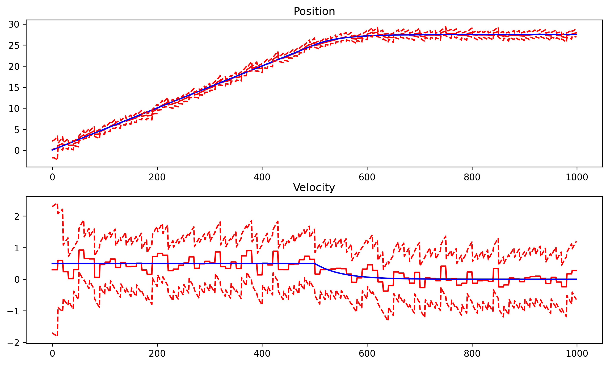
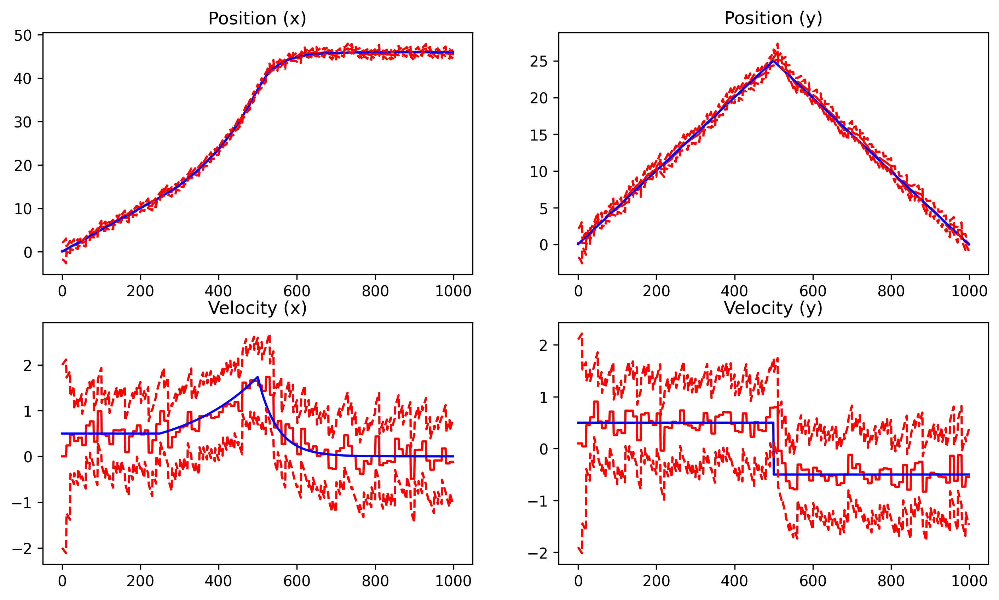
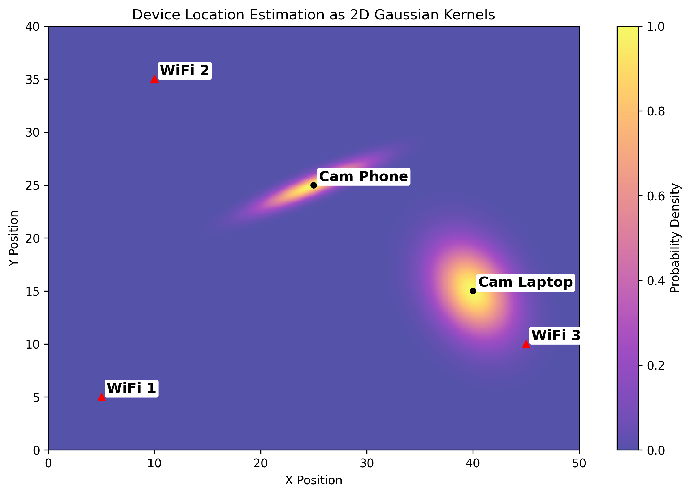

# Wifi-Trilateration-Kalman-Filter
WiFi Trilateration using a Kalman Filter and potential ML enhancements

## Design
The idea is to measure the distance from WiFi Access Points to each device (in this PoC just using WiFi beacon frames to measure distance to the laptop running the code) based on the RSSI (power) of the signal received. A Kalman Filter is used to smooth out the position, estimate movement between updates, and to give a sense of the uncertainty around the position. The WiFi sniffer looks up all the known position wifi routers and then listens to messages they emit to update the position relative to those routers.

### Kalman Filter
I wrote and tested the Kalman Filter base, 1D and 2D implementations myself to make sure I fully understand the workings of the code - however using something like the [filterpy Kalman Filter](https://filterpy.readthedocs.io/en/latest/kalman/KalmanFilter.html) would probably make sense as a more generic filter with a more performant implementation.

#### Kalman Filter Simulations
Some simulated data to ensure the predictions (red) track the true position and velocity (blue) and uncertainty increases with subsequent predictions but decreases when we update the state with a new noisy measurement (every 10 time steps).

1D Simulation                                                     | 2D Simulation
:----------------------------------------------------------------:|:-----------------------------------------------------------------:
 | 

### WiFi Sniffer
The wifi sniffer initially looks up the Wifi interfaces (could also periodically) using `iw dev <interface> scan` and then uses [scapy](https://scapy.net/) to sniff network traffic (just Beacon frames for now) to get the RSSI signal strength from each Access Point periodically.

#### WiFi Simulations
A static WiFi simulation to demonstrate the concept

A dynamic WiFi simulation to demonstrate the behaviour of the 2D Kalman Filter with the same inputs used in the simulation above when applied to this scenario

### Live Data
When running live data is captured as a CSV so that it can be played back as an animation for visualisation later. A realistic implementation of this might have multiple sniffers calling a centralised server to update positions which could be visualised live if preferred.

<!--
TODO

-->

## Development

### Set up Virtual Environment
To set up a virtual environment and start using the code
* `python -m virtualenv --python=python3.11 venv`
* `"./venv/Scripts/activate.bat"` (Note VS Code may automatically activate the venv for you)
* `pip install -r requirements.txt`

### Update the Requirements
If you have installed new packages while the virtual environment is active, to update `requirements.txt`
* `pip freeze > requirements.txt`

### Run the Tests
* `python -m pytest .`

## Run in Linux
For the docker image to have access to the WiFi network interface it needs to be run inside a Linux bare-metal install (like booting from a USB) not WSL or Docker on Windows
* Set up the Linux machine to run with docker
  * `sudo apt update`
  * `sudo apt install -y iw git curl`
  * `sudo apt-add-repository universe`
  * `curl -fsSL https://get.docker.com | sudo bash`
  * `sudo apt install -y docker.io`
* Set up monitor mode on the network interface
  * `sudo systemctl stop NetworkManager wpa_supplicant`
  * `iwconfig` to view the network interfaces - get the wireless one (starts with wl like `wlan0` or `wlp3s0`)
  * `sudo ip link set <interface> down`
  * `sudo iw dev <interface> set type monitor`
  * `sudo iw dev <interface> set monitor none`
  * `sudo ip link set <interface> up`
* NOTE: The above commands disconnect WiFi to enable monitor mode on the host (required for the sniffer to work and change channels) - to revert and re-enable WiFi run the following
  * `sudo ip link set <interface> down`
  * `sudo iw dev <interface> set type managed`
  * `sudo ip link set <interface> up`
  * `sudo systemctl restart NetworkManager wpa_supplicant`
* Clone the code to the Linux machine
  * `ssh-keygen -t ed25519 -C "<comment to identify the SSH key>"`
  * Add the SSH .pub key to Git 
  * `git clone ...` (clone the repo to the machine from git)
  * `cd Wifi-Trilateration-Kalman-Filter` (enter the repo folder)
* Run the Dockerfile
  * `sudo docker build -t wifi-container .`
  * `sudo docker run --rm -i --network host --privileged wifi-container`
